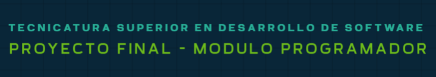

# Informe del Sistema de Gestión de Inversiones: ArgBroker

## Introducción

Este informe detalla el diseño, implementación y funcionamiento del sistema ArgBroker, una aplicación de consola destinada a facilitar la gestión de inversiones para usuarios individuales. La aplicación permite el registro de inversores, la gestión de portafolios de inversión y la realización de operaciones de compra y venta de acciones.

## Funcionalidades del Sistema

La aplicación presenta un menú de opciones accesibles una vez que el usuario inicia sesión. Las principales características son:

- **Registro de Inversores**: El sistema permite el registro de nuevos inversores, capturando datos clave como el nombre, apellido, CUIL, correo electrónico, contraseña (encriptada para mayor seguridad) y tipo de perfil de inversor.

- **Inicio de Sesión Seguro**: Implementa un sistema de inicio de sesión con validación de credenciales y encriptación de contraseñas. Se incluyen medidas de recuperación de contraseña en caso de olvido.

```
EJEMPLO PARA EL INGRESO AL SISTEMA:

- Usuario: cris24@gmail.com
- Contraseña: 1478

```

- **Gestión del Portafolio de Inversiones**: Una vez que el usuario ha iniciado sesión, puede acceder a su portafolio para:
  - Consultar datos de la cuenta, incluyendo saldo, total invertido y rendimiento.
  - Visualizar el detalle de los activos actuales, con información de cotización y rendimiento de cada activo.

- **Operaciones de Compra y Venta**: Los usuarios pueden realizar transacciones de compra y venta de acciones. La aplicación asegura la disponibilidad de fondos y la existencia de acciones al momento de la venta, y aplica una comisión de broker en cada transacción.

## Diseño de Clases y DAO

El sistema utiliza el patrón DAO (Data Access Object) para separar la lógica de negocio de la lógica de acceso a datos, logrando modularidad y bajo acoplamiento en el código. La estructura incluye las siguientes clases y componentes clave:

- **UserService**: Maneja la lógica de negocio relacionada con los usuarios, incluyendo el registro, autenticación y recuperación de contraseñas.
- **PortafolioService**: Proporciona funciones para manejar la consulta y actualización del portafolio de inversión del usuario.
- **TransaccionService**: Gestiona la lógica de negocio de las transacciones de compra y venta, coordinando validaciones y actualización de saldos y activos en el portafolio.

Cada servicio se apoya en una capa de acceso a datos (DAO), que interactúa directamente con la base de datos para realizar consultas y actualizaciones.

## Principios de Diseño y Buenas Prácticas

Se aplicaron principios de programación orientada a objetos y buenas prácticas:

- **Abstracción y Encapsulamiento**: Cada clase oculta su implementación interna, proporcionando solo métodos públicos necesarios para la operación.
- **Modularidad**: La aplicación está dividida en componentes (servicios y DAOs) que gestionan diferentes aspectos de la aplicación.
- **Bajo Acoplamiento y Alta Cohesión**: Los componentes tienen responsabilidades específicas y mínimas dependencias entre sí, promoviendo un diseño flexible y mantenible.
- **PEP 8**: Se ha respetado la convención de estilo PEP 8 para Python, utilizando `snake_case` para funciones y variables, y `PascalCase` para nombres de clases.

## Seguridad

Para proteger la información de los usuarios:

- **Encriptación de Contraseñas**: Las contraseñas se encriptan utilizando bcrypt, evitando el almacenamiento de contraseñas en texto plano.
- **Validación de Credenciales**: El sistema verifica las credenciales de acceso de forma segura, y ofrece recuperación de contraseñas a través de un sistema de validación por correo electrónico.