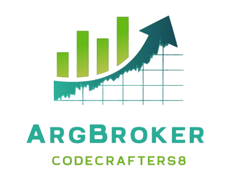

<div style="text-align: center;">
    
</div>

### Profesores:

```
PROGRAMACION I: Ing. Rojas Córsico Ivana
```
```
BASE DE DATOS: Analista Gerlero Martín
```

### Grupo: CodeCrafters8


Apellido y Nombre - Usuario GitHub

* Caceres Gimenez Cesia - [Cesiaf](https://github.com/Cesiaf)
* Dagatti Christian Edgardo - [CHRISTIANDAGATTI](https://github.com/CHRISTIANDAGATTI)
* Huk Romina - [RoHu17](https://github.com/RoHu17)

```
```

# Proyecto Integrador: ARGBroker Demo

<div style="text-align: center;">
    
</div>


## Propósito
El propósito del proyecto **ARGBroker Demo** es desarrollar una aplicación de simulación que permita a los inversores 
interactuar con el Mercado de Valores de Buenos Aires (Merval) mediante la compra y venta de acciones. 
La aplicación tiene como objetivo proporcionar a los usuarios un entorno seguro y educativo para familiarizarse 
con las transacciones bursátiles, gestionar su portafolio y comprender el funcionamiento del mercado de valores 
sin arriesgar capital real. Se busca facilitar el aprendizaje sobre los diferentes perfiles de inversores y los tipos de instrumentos
financieros disponibles.

## Contexto
La empresa **ISPC Cba** se ha inscrito como bróker de bolsa para actuar como intermediario entre los inversores y el Merval. 
Este proyecto surge de la necesidad de crear una herramienta que no solo permita realizar transacciones bursátiles, sino que también 
eduque a los usuarios sobre la dinámica del mercado, los distintos tipos de activos y las estrategias de inversión. 
En un contexto donde la inversión en acciones se ha vuelto más accesible, proporcionar un simulador permite a los nuevos inversores 
adquirir experiencia y confianza antes de realizar operaciones en un entorno real.

## Alcance
El alcance de **ARGBroker Demo** incluye:

- Desarrollo de una aplicación de consola que simula la compra y venta de acciones en el Merval.
- Funcionalidades iniciales que permiten a los usuarios:
  - Comenzar con un saldo inicial de $1.000.000.
  - Consultar cotizaciones de acciones de empresas argentinas.
  - Realizar operaciones de compra y venta a precios de mercado.
  - Visualizar un portafolio que muestre el total invertido, saldo de la cuenta demo, acciones compradas y ganancias o pérdidas.
  - Calcular y mostrar la comisión del bróker (1.5% por operación).
- Diseño de base de datos que soporte las operaciones de la aplicación, asegurando la integridad de los datos y la normalización a la 
Tercera Forma Normal (3FN).
- Documentación del diseño del sistema y la base de datos, así como la creación de un diagrama de clases que refleje las relaciones 
entre las entidades del sistema.
